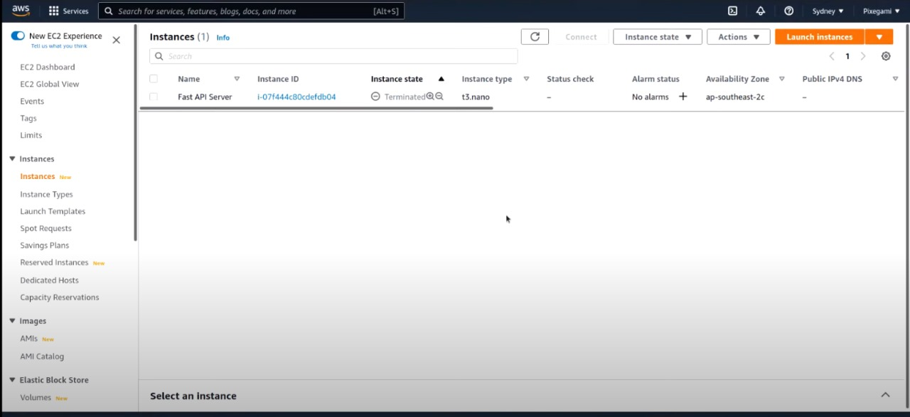
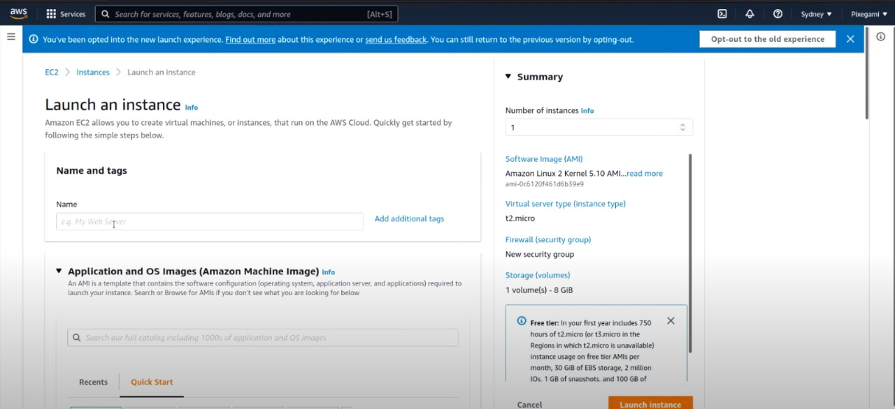
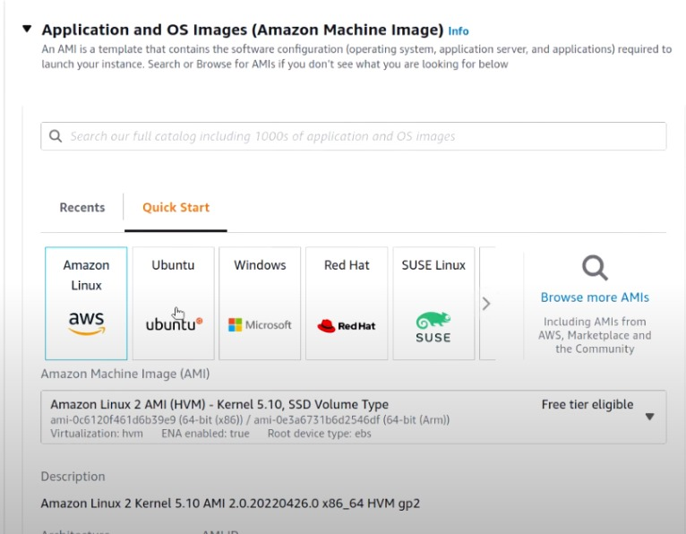
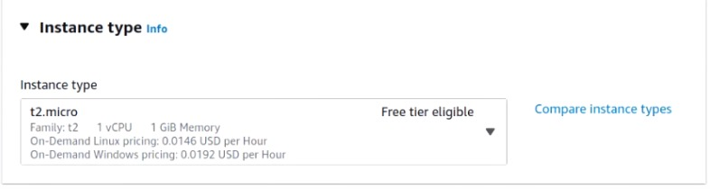
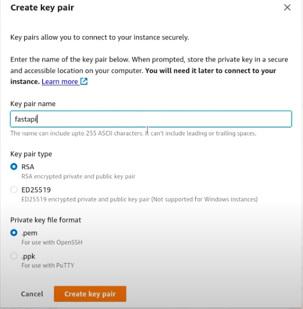
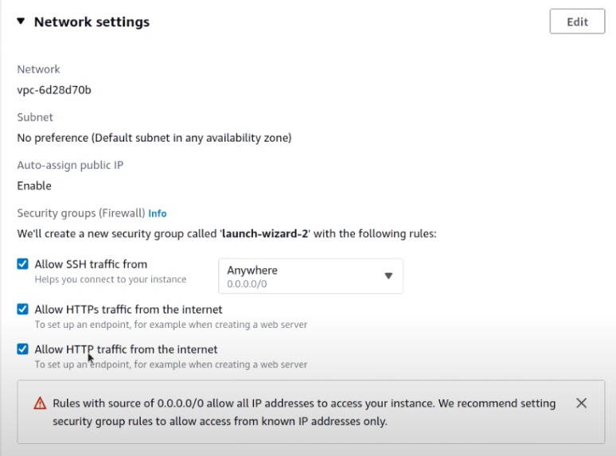
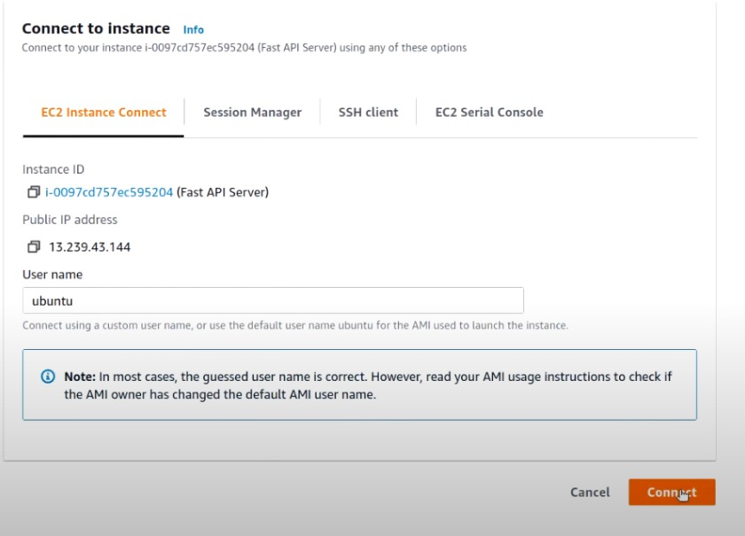
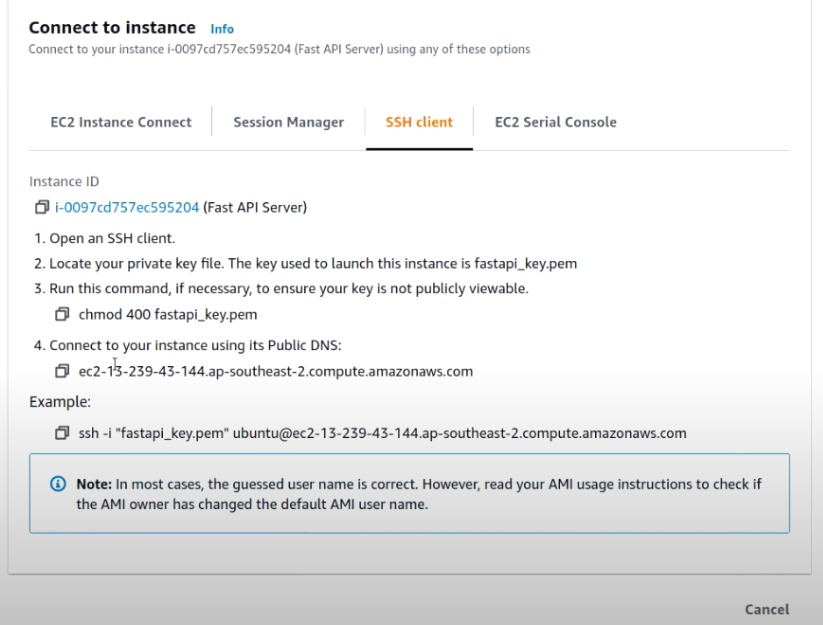
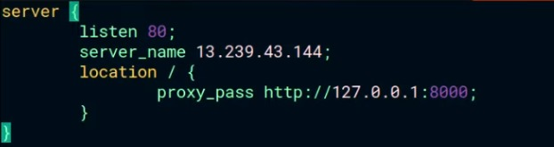

# Procedure to host Fast API on AWS.

## Step 1

login to your AWS account and go to Console.


## Step 2

Go to ec2 dashboabrd and click on launch instance.


## Step 3

### Step 3.1

Create an instance


### Step 3.2

Choose an application and Os images


### Step 3.3

Choose an instance type


### Step 3.4

Create a Key pair

Key appears in the form of .pem file. Download it and keep it safe. It will be used to connect to the instance.

## Step 4

Network Setting


Launch the instance.

Click on the instance ID to see the details of the instance.


## Step 5

Connect to the instance.


### Step 5.1

To connect to the instance via SSH client


### Step 5.2

Go to the directory where the .pem file is stored and run the following command to change the mod 400

```bash
chmod 400 file_name.pem
```

### Step 5.3

Copy the SSH command and run it in the terminal.


### Step 5.4

After succesful connection, Update the system.

Download depenedencies and install them.

```bash
Sudo apt install -y python3-pip nginx
```

Note: Nginx is used to host the Fast API on the server. It is a web server that can be used to host the Fast API. Load balancer can also be used to host the Fast API.

### Step 5.5

Create a Nginx configuration file.

```bash
sudo vim /etc/nginx/sites-enabled/fastapi_ngnix
```

### Step 5.6

Create a server block in the configuration file.

```bash
server {
    listen 80;
    server_name _(public ipv4 of the instance)_;
    location / {
        proxy_pass http://127.0.0.1:8000;
```



### Step 5.7

Restart the Nginx server.

```bash
sudo service nginx restart
```

### Step 5.8

Git clone your Repository to the instance machine.


### Step 5.9

Set up your project. install all dependencies and run the python server with the following command.

```bash
python3 -m uvicorn file_name:app --host
```

# References
https://education.github.com/